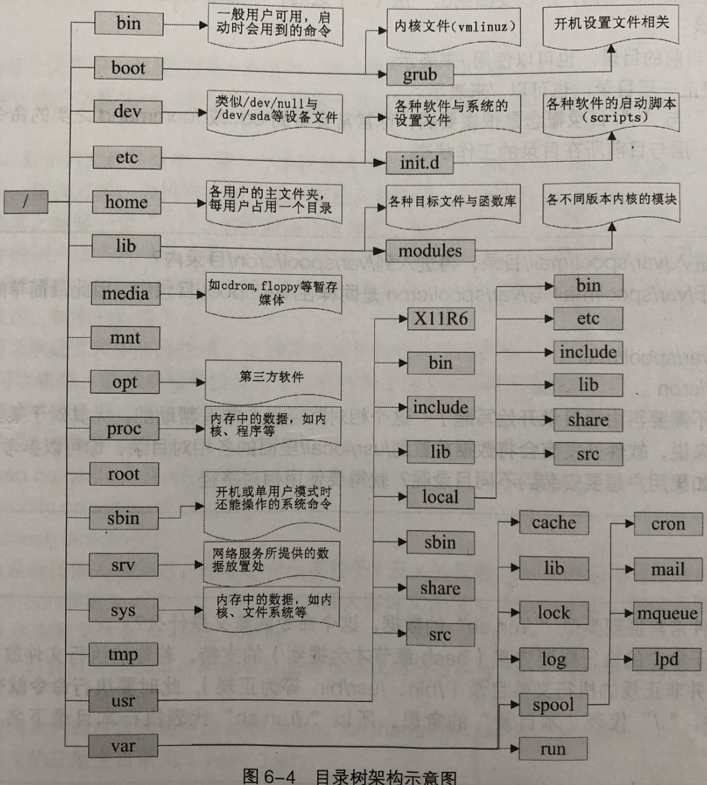

# 第6章 Linux的文件权限与目录配置
## 6.1 用户与用户组
Linux用户身份与用户组记录的文件

 * /etc/passwd # 默认情况下所有系统上的账号与一般身份用户，还有root相关信息
 * /etc/shadow # 个人的密码记录文件
 * /etc/group  # 组名记录文件

## 6.2 Linux文件概念

### 6.2.1 Linux文件属性
```
➜  ~ ls -al
总用量 72644
dr-xr-x---. 11 root root     4096 10月  6 19:05 .
dr-xr-xr-x. 18 root root     4096 3月  16 2018 ..
-rw-------   1 root root     8663 6月   8 18:01 .bash_history
-rw-r--r--.  1 root root       18 12月 29 2013 .bash_logout
```
* 第一列代表这个文件的类型和权限。第一个字符代表这个文件是“目录、文件或链接文件”
* 第二列代表有多少文件名连接到此节点（i-node）
* 第三列代表这个文件（或目录）的所有者账号
* 第四列表示这个文件的所属用户组
* 第五列代表这个文件的容量大小，单位默认为B
* 第六列代表这个文件的创建文件日期或是最近修改的日期
* 第七列代表为该文件名

### 6.2.2 修改文件属性与权限
* chgrp（change group）
* chown（change owner）
* chmod（change mode） 

### 6.2.3 目录与文件的权限意义
* 对文件来说，权限的效能为：
	- r： 可读取此文件的实际内容，如读取文本文件的文字内容
	- w： 可以编辑、新增或者修改该文件的内容（但不包含删除该文件）
	- x： 该文件具有可以被系统执行的权限
* 对目录来说，权限的属能为
	- r： read contents in directory
	- w： modify content of directory
	- x： access directory	

### 6.2.4 Linux文件种类与拓展名
#### 文件种类
* 一般文件（-）
* 目录文件（d， directory）
* 连接文件（l， link）
* 设备与设备文件（device）
	- 块（b， block）设备文件， 存储相关， `/dev/sda`
	- 字符（c， character）设备文件, 串行端口的接口设备
* 套接字（s， sockets），`/var/run`
* 管道（F， FIFO， pipe）， 主要目的在解决多个程序同时访问一个文件所造成的错误问题

#### Linux文件拓展名
一个Linux文件能不能被执行，与它的第一列的10个属性相关，与文件名一点关系都没有。下面的拓展名是为了了解该文件是做什么的。

* `*.sh`	脚本或者批处理文件
* `*Z、 *.tar、 *.tar.gz、 *.zip、 *.tgz`	经过打包的压缩文件
* `*.html、 *.php` 网页相关文件

> 从网络传输文件，容易导致文件的权限与属性改变，如下载一个可执行文件在本地系统可能会无法执行

## 6.3 Linux目录配置
### 6.3.1 Linux目录配置标准：FHS
FHS（Filesystem Hierarchy Standard）， 目的是希望让用户了解到已安装软件通常放在哪个目录下。FHS依据文件系统**使用的频繁与否**与**是否允许用户随意改动**，而将目录定义成四种交互作用的形态。
 
   | 可分享的（shareable） | 不可分享的（unshareable）
------- | --------------|-------
不变的（static）    | `/usr`: 软件放置处   `/opt`: 第三方软件     |`/etc`: 配置文件  `/boot`: 开机与内核文件 
可变动的（variable） |`/var/mail`: 用户邮件信箱  `/var/spool/news`: 新闻组    | `/var/run`: 程序相关  `/var/lock`: 程序相关

* **可分享的：**可以分享给其他系统挂载使用的目录， 执行文件、用户的邮件
* **不可分享的：**自己机器上运行的设备文件或者与程序有关的socket文件
* **不变的：**跟随者distribution而不变的数据，函数库、文件说明文件、系统管理员所管理的主机服务配置文件
* **可变动的：**经常改动的数据，登录文件、新闻组等

FHS仅定义了如下三层目录应该放置什么数据

* /(root, 根目录)： 与开机系统有关， 开机、修复、系统修复等操作有关。根目录（/)所在分区应该越小越好，且应用程序所安装的软件最好不要与根目录放在同一个分区内，保持根目录越小越好。如此不但性能较好，根目录所在文件系统也不容易出问题
	- `/bin`: 系统放置执行文件的目录， 有`cat chmod chown date mv mkdir cp bash`
	- `/boot`: 放置开机会使用的文件， Linux内核文件、开机菜单、开机配置文件等
	- `/dev`: 存在设备文件， `/dev/null /dev/zero /dev/tty /dev/lp* /dev/hd* /dev/sd`
	- `/etc`: 配置文件， 账号密码文件、服务的起始文件。**FHS建议不要在该文件夹放置可执行文件（binary）**。`/etc/modprobe.conf /etc/X11 /etc/fstab /etc/sysconfig`
		* `/etc/init.d`: 所有服务的默认启动脚本都在这里。如`/etc/init.d/iptables start /etc/init.d/iptables stop`
		* `/etc/xinetd.d`: super daemon管理的各项服务的配置文件目录
		* `/etc/X11`:与X Window有关的配置文件
	- `/home`: 系统默认用户主文件夹
	- `/lib`: 开机使用的函数库，以及在/bin或/sbin下面的命令会调用的函数库
	- `/media`: 放置可删除的设备
	- `/mnt`: 挂载额外设备
	- `/opt`: 第三方软件放置
	- `/root`: 系统管理员的主文件夹
	- `/sbin`: 放置开机需要的**开机、修复、还原系统所需要的命令**。本机自行安装的软件产生的系统执行文件（system binary），则放置在`/usr/local/sbin`。
	- `/srv`: 一些网络服务启动之后，所需要取用的数据目录。如WWW、FTP
	- `/tmp`: 一般用户或者是正在执行的程序暂时放置文件的地方
	- */lost+found : 使用ext2/ext3产生的目录， 当文件系统发生错误时，将一些丢失的片段放置到这个目录下*
	- */proc : 虚拟文件系统，其放置数据都在内存中，不占硬盘空间， 如系统内核、进程（process）、外部设备的状态以及网络状态*
	- */sys : 虚拟文件系统，不占硬盘空间， 也是记录内核相关的信息，如目前已加载的内核模块与内核检测到的硬件设备信息*

*斜体文字*代表FHS针对根目录定义标准之外的目录
	
* /usr(UNIX software resource)： 与软件安装/执行有关。**安装时会占用较大硬盘容量的目录**，UNIX Software Resource的缩写，即”UNIX操作系统软件资源“所放置的目录，而不是用户的数据，里面放置的数据属于**可分享与不可变动**。*FHS建议所有软件开发者应该将他们的数据合理地放置到这个目录下的子目录，而不要自行创建该软件自己独立的目录*。
	- `/usr/X11R6/`: 为X Window系统重要数据所放置的目录，最后X版本为第11版，且改版的第6次释出之意
	- `/usr/bin/`: 用户命令
	- `/usr/include`: C/C++等程序语言的头文件（header）与包含文件（include）放置的地方
	- `/usr/lib/`: 各应用软件的函数库、目标文件（object file），以及不被一般用户惯用的执行文件或脚本（script）。X86_64系统，	`/usr/lib/`
	- `/usr/local/`: 系统管理员在本机自行安装自己下载的软件（非distribution默认提供者）的目录。如当前的distribution提供的软件较旧，可以在不删除下将新版软件安装在`/usr/local/`下
	- `/usr/sbin/`: 非系统正常运行所需要的系统命令。如某些网络服务器软件的服务命令（daemon）
	- `/usr/share/`: 放置共享文件的地方
		* `/usr/share/man`: 在线帮助文档
		* `/usr/share/doc`: 软件杂项的软件说明
		* `/usr/share/zoneinfo`: 时区有关的时区文件
	- `/usr/src/`: 一般源码目录。linux内核源码建议放置在`/usr/src/linux/`目录下
* /var(variable)： 与系统运作有关。`/var`目录主要针对常态性变动的文件，包含缓存（cache）、登录文件（log file）以及某些软件运行所产生的文件，包含程序文件（lock file，run file），或者如MySQL数据库的文件等。**在系统运行后才会渐渐占用硬盘容量的目录**。
	- `/var/cache/`: 应用程勋运行过程产生的一些暂存软件
	- `/var/lib/`: 程序执行过程需要的**数据文件**放置地方。MySQL： `/var/lib/mysql/`, rpm： `/var/lib/rpm`
	- `/var/lock/`: 设备或者文件资源锁的目录
	- `/var/log/`: 登录文件目录。`/var/log/messages, /var/log/wtmp（记录登录者的信息)`
	- `/var/mail/`: 个人电子邮件信箱的目录，与`/var/spool/mail/`目录互为连接文件
	- `/var/run/`: 一些程序或者服务启动后PID放置的目录
	- `/var/spool/`: 放置一些队列数据，即排队等待其他程序使用的数据。一般这些数据被使用后通常会被删除。

有五个目录不可与根目录放在不同的分区，分别为: `/etc /bin /lib /dev /sbin`

### 目录树（directory tree）
所有文件与目录都是由根目录开始的，然后一个一个分支下去，有点像树形状。也称这种目录配置方式为”目录树（directory tree）“。

* 目录树的起点为根目录（/, root）
* 每一个目录不只能使用本地的文件系统，还可以使用网络上的文件系统。如利用Network File System（NFS）服务器挂载某特定目录等。
* 每一个文件在此目录树下的文件名（包含完整路径）都是独一无二

Centos根目录的目录架构图

	

### 绝对路径与相对路径
* 绝对路径： 由根目录开始写起的文件名或者目录名称
* 相对路径： 相对目前路径的文件名写法。

### Centos的查看
查看distribution使用的那个linux标准（Linux Standard Base)

```
➜  ~ uname -r
3.10.0-693.2.2.el7.x86_64
➜  ~ lsb-release -a
```

    
    
    
 
       
   

 
	
  
 
 
