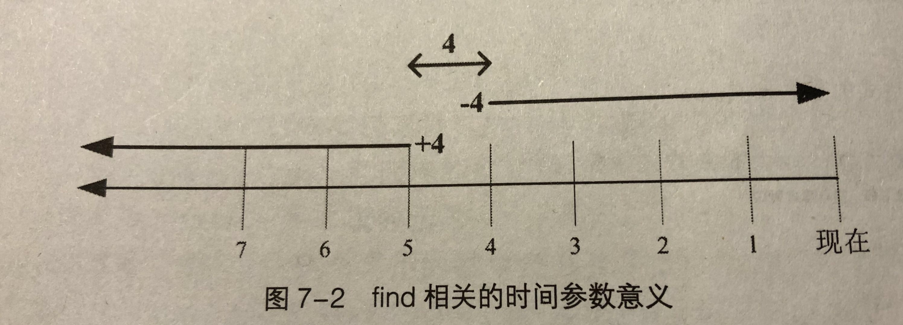

# 第7章 Linux文件与目录管理
## 7.1 目录与路径
### 7.1.1 相对路径与绝对路径
* **绝对路径：**绝对路径的写法一定是由根目录`/`写起， 例如`/usr/share/doc`这个目录
* **相对路径：**路径的写法不是有`/`写起，例如由`/usr/share/doc`这个目录到`/usr/share/man`下面时，可以写成`cd ../man`，这就是相对路径的写法。

### 7.1.2 目录的相关操作
```
特殊目录
.	代表此层目录
..	代表上层目录
-	代表前一个工作目录
~ 	代表当前用户所在的主文件夹
~account	代表account这个用户的主文件夹（account是账号的名称）
```

* cd（切换目录）
* pwd（显示目前所在目录）
	- pwd -P（显示正确的完整路径）
* mkdir（新建新目录）
* rmdir（删除“空”目录）

### 7.1.3 关于执行文件路径的变量： $PATH
```
# 查看当前用户执行文件的路径
➜  ~ echo $PATH 
/usr/local/sbin:/usr/local/bin:/usr/sbin:/usr/bin:/root/bin
# 将/root加入PATH中
➜  ~ PATH="$PATH":/root
```

## 7.2 文件与目录管理
* 查看文件与目录： `ls`
* 复制、删除与移动： `cp, rm, mv`

取得路径的文件名与目录名称

```
# 取得路径的文件名
➜  ~ basename /etc/sysconfig/network
network
➜  ~ dirname /etc/sysconfig/network
# 取得路径的目录名称
/etc/sysconfig
```

## 7.3 文件内容查阅

* cat： 由第一行开始显示文件内容（重要）
* tac： 从最后一行开始显示， tac是cat的倒写形式
* nl： 显示的时候顺便输出行号
* more： 一页一页地显示文件的内容
* less： 与more类似，但比more相比，支持往前翻页（重要）
* head： 只看头几行
* tail： 只看尾几行
* od： 以二进制的形式读取文件内容(不懂，第一次接触)
* touch： 修改文件时间或者创建新文件

```
# 显示最后的20行
➜  ~ tail -n 20 /etc/man_db.conf
# 显示100行以后的数据
➜  ~ tail -n +100 /etc/man_db.conf
# 持续监测man_db.conf内容
➜  ~ tail -f /etc/man_db.conf

# 新建空文件
➜  ~ touch testtouch
# 将testtouch文件的mtime调整至2天前
➜  ~ touch -d "2 days ago" testtouch
➜  ~ ls -l testtouch
-rw-r--r-- 1 root root 0 10月  7 23:39 testtouch
```

**Linux系统下文件的主要变动时间参数：**

* modification time（mtime）： 当该文件的“内容数据”更改时，就会更新这个时间；
* status time（ctime）： 当这个文件的“状态”改变时， 就会更新这个时间，如权限与属性被更改了， 都会更新这个时间
* access time（atime）： 当文件被读取时就会更新这个时间，如cat去读文件就会更新该文件的atime


## 7.4 文件与目录的默认权限与隐藏权限
### 7.4.1 文件默认权限： umask
umask就是指定“目前用户在新建文件或目录时候的权限默认值”，该默认值是需要被减掉的权限

在默认权限的属性上，目录与文件是不一样的：

* 用户新建“文件”默认权限： -rw-rw-rw-
* 用户新建“目录”默认权限： drwxrwxrwx
* 新建文件时： （-rw-rw-rw-）-（-----w-w-）==> -rw-r--r--
* 新建目录时：（drwxrwxrwx）-（d----w--w-）==> drwxr-xr-x

```
➜  ~ umask
022
➜  ~ umask -S
u=rwx,g=rx,o=rx
➜  ~ umask 002 # 默认权限减去其他身份的写权限
```

### 7.4.2 文件隐藏属性chattr， lsattr
chattr命令只能在Ext2/Ext3的文件系统上使用

```
➜  ~ chattr +i test # test不能被删除、改名，设置连接也无法写入或者添加数据
➜  ~ chattr -i test
➜  ~ chattr +a test # 被添加数据，不能被删除或者修改，设置连接也无法写入或者添加数据
➜  ~ chattr -a test

➜  ~ lsattr nohup.out   # 显示文件隐藏属性
```

### 7.4.3 文件特殊权限SUID， SGID， SBIT

/tmp 和 /usr/bin/passwd的权限

```shell
➜  ~ ls -ld /tmp;ls -l /usr/bin/passwd
drwxrwxrwt. 9 root root 4096 10月 28 03:21 /tmp
-rwsr-xr-x. 1 root root 27832 6月  10 2014 /usr/bin/passwd
➜  ~ ls -l /usr/bin/locate
-rwx--s--x 1 root locate 38680 12月  1 2017 /usr/bin/locate
```

* SetUID (SUID)

  **当s这个标志出现在文件所有者的x权限上时， 例如上述 `/usr/bin/passwd` 这个文件的权限状态为 `-rwsr-xr-x` 此时被称为Set UID， 简称为Set UID的特殊权限**。

  * SUID权限仅对二进制程序有效
  * 执行对改程序需要具有x的执行权限
  * 本程序仅在执行该程序的过程中有效
  * **执行者将具有该程序所有者的权限**

  例如：在linux系统中，账号的密码文件 `/etc/shadow` 的权限为 `-r-------- 1 root root` ,表示这个文件仅有root用户可读且可以强制写入。然而一般用户却有权限修改自己的密码，即修改 `/etc/shadow` 文件。这就是SUID的功能。

  1. vbird对于 `/usr/bin/passwd` 这个程序是有x权限的， 表示vbird能执行passwd；
  2. passwd的拥有者是root账号；
  3. vbird执行passwd的过程，会“暂时”获取到root权限；
  4. `/etc/shadow` 可以被vbird所执行的passwd所修改

* Set GID （SGID）l

  **当s标志在文件用户组的x位置时称为Set GID， SGID。**

  当一个文件设置了SGID权限后

  * SGID对二进制程序有用；
  * 程序执行者对于该程序来说，需具备x的权限；
  * **执行者在执行的过程中会获得该程序用户组的支持**；

  当一个目录设置了SGID权限后

  * 用户若对于此目录具有r与x的权限时， 该用户能够进入此目录；
  * 用户在此目录下的有效用户组（effective group）将变成该目录的用户组；
  * 若用户在此目录具有w的权限（可以新建文件），则用户所创建的新文件的用户组与此目录的用户组相同。 

* Sticky Bit

  当t标志在其他用户的x位置时称为Sticky Bit（SBIT）权限

  * 如果将A目录加上了SBIT的权限项目时， 则甲只能够针对自己创建的文件或者目录进行删除、重命名、移动等操作，而无法删除他人的文件

* SUID/SGID/SBIT权限设置

  * 4为SUID， u+s

  * 2为SGID， g+s

  * 1为SBIT， o+t

    ```shell
    ➜  ~ cd /tmp
    ➜  /tmp touch test    
    ➜  /tmp chmod 4755 test; ls -l test			--加入具有SUID的权限
    -rwsr-xr-x 1 root root 0 10月 28 22:33 test	
    ➜  /tmp chmod 6755 test; ls -l test			--加入具有SUID/SGID的权限
    -rwsr-sr-x 1 root root 0 10月 28 22:33 test
    ➜  /tmp chmod 1755 test; ls -l test			--加入具有SBIT的权限
    -rwxr-xr-t 1 root root 0 10月 28 22:33 test
    ➜  /tmp chmod 7666 test; ls -l test			--加入具有空的SUID/SGID/SBIT的权限
    -rwSrwSrwT 1 root root 0 10月 28 22:33 test
    
    # 设置权限称为 -rws--x--x
    ➜  /tmp chmod u=rwxs,go=x test; l test
    -rws--x--x 1 root root 0 10月 28 22:33 test
    # 在文件权限加上SGID与SBIT
    ➜  /tmp chmod g+x,o+t test; l test
    -rws--x--t 1 root root 0 10月 28 22:33 test
    ```


### 7.4.4 查看文件类型： file

```shell
➜  ~ file .bashrc
.bashrc: ASCII text # ASCII 的纯文本文件
➜  ~ file /usr/bin/passwd
/usr/bin/passwd: setuid ELF 64-bit LSB shared object, x86-64, version 1 (SYSV), dynamically linked (uses shared libs), for GNU/Linux 2.6.32, BuildID[sha1]=1e5735bf7b317e60bcb907f1989951f6abd50e8d, stripped
# 这个文件的suid权限兼容与Intel x86-64等级的硬件平台， 使用的是Linux核心2.6.9的动态函数库链接等
```

## 7.5 命令与文件的查询

### 7.5.1 脚本文件名的查询

* which（根据PATH环境变量所规范的路径去查询“执行文件”的文件名， -a参数列出所有同名文件）

### 7.5.2 文件名的查找

whereis和locate利用的是数据库来查找， Linux系统会将系统中的所有文件记录在一个数据库文件里面，数据库的默认创建更新每天执行一次（视distribution而定）；find直接查询硬盘，效率视硬盘性能而定，故前两者的效率更高。

* whereis（寻找完整名称文件）

* locate (查找部分名称的文件,  由已创建的数据库 `/var/lib/mlocate` 里面数据查找到)

* updatedb(根据 `/etc/updatedb.conf ` 的设置查找系统硬盘内的文件名，并更新 `/var/lib/mlocate` 内的数据库文件 )

* locate（依据 `/var/lib/mlocate` 内的数据库记载，找到输入的关键字文件名）

* find

  ```shell
  ➜  ~ find [PATH] [option] [action]
  参数：
  1. 与时间有关的参数： -atime、-ctime、-mtime，例如：
  	-mtime n： n天之前的"一天之内"被修改的文件
  	-mtime +n： 列出n天之前(不包含n)被更改过的文件名
  	-mtime -n： 列出n天之内(包含n)被更改过的文件名
  	-newer file： file为一个存在的文件， 列出比其更新的文件名
  # 将系统时间过去24小时内的有改动(mtime)的文件列出
  ➜  ~ find / -mtime 0
  # 寻找/etc下面的文件，如果文件日期比 /etc/passwd 新就列出
  ➜  ~ find /etc -newer /etc/passwd
  ```

  

  ```shell
  2. 与用户或用户组名有关的参数
     -uid n: n为用户的账号ID，即UID，记录在/etc/passwd里面与账户名称对应的数字
     -gid n: n为用户组名的ID， GID， 记录在/etc/group
     -user name: name为用户的账号名
     -group name:
     -nouser ： 寻找文件所有者不存在/etc/passwd 的人，尤其源码自行编译软件
     -nogroup： 寻找文件所有者所在用户组不存在于/etc/group 中的文件
     
   # 查找/home下面属于martin的文件
  ➜  ~ find /home -user martin
  ```

  ```shell
  3. 与文件权限及名称有关的参数
     -name filename:
     -size [+-]SIZE
     -type TYPE: 查找文件类型： 正规文件(f）、设备文件(b、c)、目录(d)、链接文件(l)、socket(s)、FIFO(p)等属性
     
  ```


